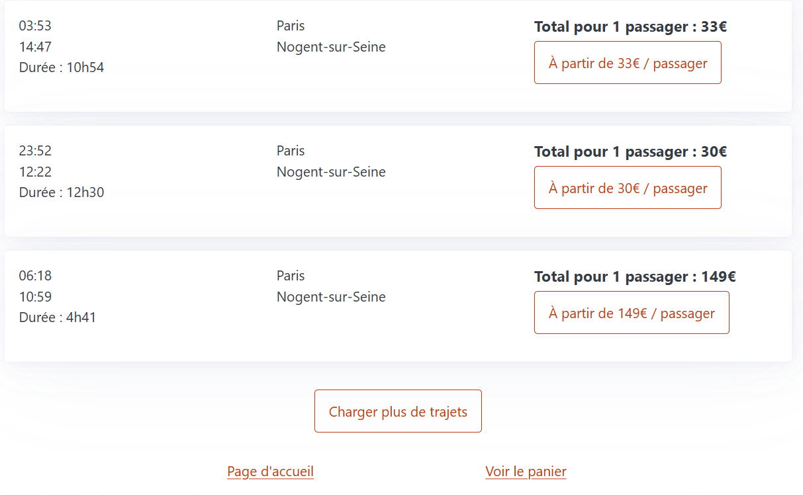
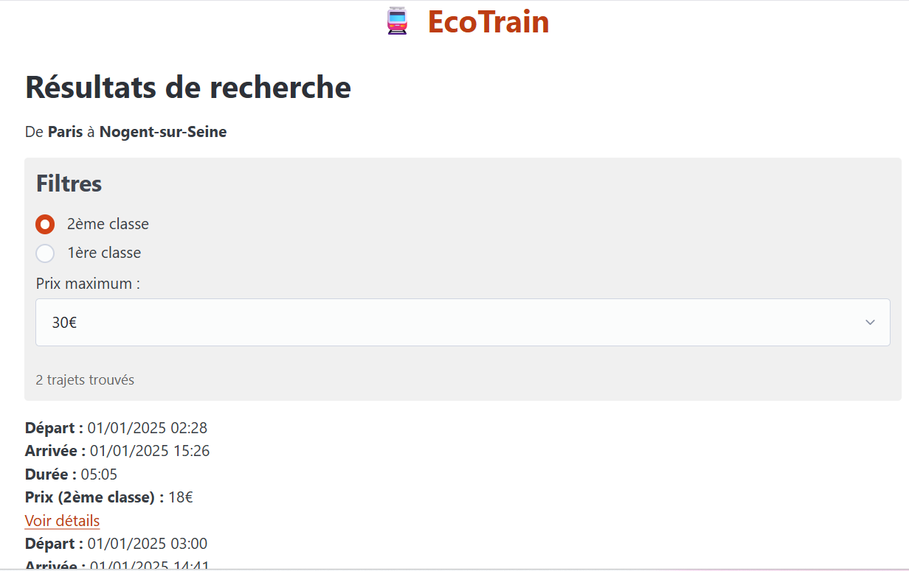

# Réduction de l'impact environnemental des plateformes de réservation de trains 

## Choix du sujet
On utilise presque tous le site ou l’application de la SNCF pour regarder un horaire ou acheter un billet. C’est devenu un réflexe du quotidien, un service que beaucoup considèrent comme indispensable, surtout quand on sait que 122 millions de voyageurs ont pris le TGV en 2023. On parle souvent du train comme d’un moyen de transport écologique, mais on oublie que tout commence en ligne. 
Est-ce que l’outil numérique qu’on utilise pour voyager est vraiment aussi « vert » qu’on le pense ? 
Même si tout paraît immatériel, chaque clic consomme de l’énergie. Notre objectif est donc simple : mesurer l’impact environnemental de l’application web de la SNCF, pour voir si la face numérique du train est aussi propre que ses rails. 
  
## Utilité sociale
### Des transports longue distance
Les transports longue distance, comme ceux proposés par la SNCF, sont bien plus qu’un simple moyen de se déplacer : ils contribuent directement à une mobilité plus durable et accessible pour tous.

**Accès à l’emploi** : par exemple, un habitant de Romilly peut travailler à Troyes ou même à Paris grâce aux liaisons ferroviaires régulières. Sans ces trajets, certaines carrières seraient tout simplement impossibles.

**Accès aux services publics** : santé, éducation, administration… tout devient plus atteignable, même quand on vit loin des grandes villes.

**Lien entre les territoires** : le train connecte des régions parfois isolées, créant un sentiment d’appartenance nationale.

**Outil de décentralisation** : il rend moins nécessaire de vivre dans les grandes métropoles pour avoir les mêmes opportunités.

### Des applications (SNCF Connect)
Les applications ne sont pas nécessaires à l'emploi des solutions de transport. En revanche, elles contribuent fortement à la simplification des démarches :
- Planification simplifiée
- Visibilité des offres de réduction
- Accès aux informations (horaires)
- Achat des billets
- Meilleure compréhension et gain de temps

Ces applications permettent de favoriser l'accès à l'information. Dans le cas de SNCF connect par exemple, c'est également un parcours utilisateur qui a entièrement été repensé ces dernières années pour le simplifier, et améliorer l'aisance d'utilisation.

En somme, les applications permettent une plus forte fréquentation des services, grâce à la facilitation des démarches liées aux déplacements longue distance

## Effets de la numérisation
Les applications numériques de la SNCF remplacent en partie les billets papier achetés au guichet ainsi que les informations affichées en gare. Ces alternatives « physiques » existent toujours, mais elles sont désormais utilisées en solution de secours, plutôt qu’en premier réflexe.

Par exemple, de nombreuses gares ont réduit leurs horaires d’ouverture ou fermé certains guichets, obligeant les usagers à passer par l’application ou les bornes automatiques. Dans certaines petites gares, il n’y a même plus aucun personnel sur place : sans smartphone ou connexion Internet, acheter un billet devient un véritable parcours du combattant.

## Scénarios d'usage et impacts
Nous imaginons deux scénarios d'utilisation des applications de réservation de trains : l'achat d'un billet de train et la consultation de son billet. D'autres scénarios peuvent être envisagés, comme la consultation des horaires, mais ce scénario ressemble fortement au scénario de réservation de billet.

### Scénario 1 : "Achat d'un billet de train"
1. L'utilisateur renseigne ses gares de départ et de destination, ainsi que la date du voyage.
2. Ensuite, il sélectionne le voyage de son choix parmi ceux proposés.
3. Puis il sélectionne les options de son voyage (seconde ou première classe, option vélo, siège)
4. Enfin, il valide le voyage et passe au paiement

### Scénario 2 : "Consultation de billets de train"
1. L'utilisateur se connecte à son espace.
2. Il sélectionne le voyage à venir concerné.
3. Il accède au billet, et peut par exemple le télécharger.

## Impact de l'exécution du scénario auprès de différents services concurrents
L'EcoIndex d'une page (de A à G) est calculé (sources : EcoIndex, Octo, GreenIT) en fonction du positionnement de cette page parmi les pages mondiales concernant :
- le nombre de requêtes lancées,
- le poids des téléchargements,
- le nombre d'éléments du document.

Nous avons choisi de comparer l'impact des scénarios sur les plateformes de réservation de train de divers pays, appartenant à des compagnies ou non (SNCF Connect, Deutsche Bahn, 1.2.Train, Omio, Eurostar)

|Service|Score (sur 100)|Classe|Détail des mesures|
|---|---|---|---|
|SNCF Connect| 23  | F 🔴  | [...](https://github.com/UTT-GL03/EcoTrain/blob/main/benchmark/SNCF%20Connect/declaration-environnementale.md)  |
|DB| 32 | E 🟠 | [...](https://github.com/UTT-GL03/EcoTrain/blob/main/benchmark/Deutsche%20Bahn/declaration-environnementale.md)  | 
|1.2.Train|82|  A 🔵 | [...](https://github.com/UTT-GL03/EcoTrain/blob/main/benchmark/1.2.Train/declaration-environnementale.md)  | 
|Omio| 40  | D 🟡  | [...](https://github.com/UTT-GL03/EcoTrain/blob/main/benchmark/Omio/declaration-environnementale.md)  | 
|Eurostar| 15  | F 🔴 | [...](https://github.com/UTT-GL03/EcoTrain/blob/main/benchmark/Eurostar/declaration-environnementale.md)  | 

__Tab.1__ : Mesure de l'EcoIndex moyen de divers services de réservation de trains.

Les mesures de l'impact moyen de ces services (cf. Tab.1) révèlent des classes EcoIndex très faibles pour la plupart (D à F). Seule la solution 1.2.Train, indépendante des compagnies, se démarque avec un score élevé (A). Cela peut s'expliquer par la structure très simple du site.

## Modèle économique
Comme nous l'avons vu dans la section précédente, parmi les choix de conception ayant le plus d'impact environnemental, la plupart sont directement liés au modèle économique du service. C'est pourquoi il est nécessaire à ce stade d'analyser leur modèle économique et de définir notre propre modèle permettant une conception plus frugale. 

|Service|Source de revenus|
|---|---|
|SNCF Connect|Vente de billets|
|DB|Vente de billets|
|1.2.Train|Commissions|
|Omio|Commissions|
|Eurostar|Vente de billets|

__Tab.2__ : Offre des services de réservation de billets de train.

Notre marché semble être structuré en oligopôle : il y a plusieurs offreurs pour acheter le même billet de train. Le billet vendu est le même sur les différentes plateformes mais ces plateformes ne sont pas entièrement identiques : fluidité, interface, expérience utilisateur. Les services de réservation sont substituables entre eux : si l'on ne souhaite pas acheter son billet de train sur SNCF Connect, on peut l'acheter sur 1.2.Train ou sur Omio.

1.2.Train dispose d'un modèle économique fragile qu'il serait pertinent de renforcer, mais le site web est déjà suffisamment sobre pour que l'on ne se penche pas sur ce cas dans le cadre de notre projet. Nous trvavaillerons donc sur SNCF Connect. Il n'y a pas de publicité sur la plateforme, qui semble uniquement se financer grâce aux revenus des ventes de billets de train (service annexe). Nous voyons donc peu d'autres modèles économiques pertinents, sachant que celui-ci semble largement viable.

|Source possible de revenus|Montant unitaire|Quantité nécessaire pour financer un salaire[^1]|
|---|---|---|
|Part sur les ventes de billets[^2]|0,90€|3966|

[^1]: Basé sur le coût total employeur du salaire médian 2025 soit 3569€ environ (source : [URSSAF](https://mon-entreprise.urssaf.fr/simulateurs/salaire-brut-net))
[^2]: Estimation sur la base de 2% des billets dédiée à la plateforme, les billets étant à 45€ en moyenne

## Maquette de l'interface et échantillon de données
Au vu des différents services comparés, des exigences environnementales exprimées plus haut et des scénarios retenus, nous avons défini pour notre prototype une maquette de l'interface et un échantillon de données réalistes.

Les ressources Web possédant une représentation sur notre application seront de deux types :
- Les résultats de recherche de voyage (avec une HTTP-URI ayant pour chemin /?depart={gare_depart}&arrivee={gare_arrivee}&date={date})
- Un voyage proposé (avec une HTTP-URI ayant pour chemin /{id})
  
   

__Fig.1__: Maquette de la page de recherche // __Fig.2__: Maquette de la page de résultats de recherche

Dans un objectif de sobriété environnementale, les résultats de recherche se limiterons à ceux du jour sélectionné.

Pour des raisons de respect des droits d'auteurs, nous utilisons des données générées (avec [dummy-json](https://dummyjson.com/)). Bien que fictives, ces données correspondent à la structure des services concurrents : les voyages comportent une gare de départ et d'arrivée, une date, une heure de départ et d'arrivée, et un ou plusieurs tarifs.

## Implémentation du scénario prioritaire

### Prototypage : Fonctionnalités pour le scénario prioritaire avec données chargées de manière statique
Pour cette première version du prototype (v1.0.0):
- l'échantillon de données est encore chargé dans le code de manière statique,
- les fonctionnalités implémentées ne sont que celles nécessaires pour suivre le scénario prioritaire ("Acheter un billet de train").

Ce scénario nécessite de pouvoir naviguer entre plusieurs pages : 
- la page de recherche de voyage, où il est possible de rechercher des trajets
- la page de résultats, où s'affichent les trajets correspondant aux critères
- la page de détails du trajet, une fois celui-ci sélectionné
- le panier, avant de passer au paiement du ou des billet(s)

### Page de recherche de voyage
La page d'accueil renvoie un formulaire permettant de renseigner ses critères de recherche de voyage.

__Fig.3__ : Prototype de la page de recherche de voyage

Pour l'instant, nous avons choisi un framework de mise en page minimaliste (PicoCSS). Dans la suite du projet, nous verrons si l'impact environnemental du passage à un framework de mise en page plus puissant (comme Bootstrap) est acceptable.

Nous avons également fait le choix de ne pas inclure de photographies, celles-ci n'état pas nécessaires à la réservation d'un billet de train.

Dans l'état actuel du prototype, il est possible d'avoir une première idée de l'impact environnemental du frontend. Bien entendu, il manque encore le chargement dynamique des données, mais nous pouvons déjà évaluer l'impact de l'affichage des données et du framework (au sens large : React, PicoCSS). Cette évaluation de l'impact (cf. Tab.3) est déjà encourageante en mode "développement" mais encore plus en mode "pré-production". Nous mesurons ici l'effet positif de l'adoption d'outils de développement Web intégrant la ["minification"](https://fr.wikipedia.org/wiki/Minification) (cf. Wikipédia) du code et la concaténation du code d'une part et des feuilles de style d'autre part.

| |EcoIndex|GES (gCO2e)|Taille du DOM|Requêtes|Taille de la page (ko)|
|---|---|---|---|---|---|
|Mode "développement"|79 B 🟢 |1.42|81|29|1873|
|Mode "pré-production"|91 A 🔵|1.18|78|6|145|

__Tab.3__ Mesure de l'EcoIndex moyen de notre prototype, dans le cadre du scénario n°1

### Page de résultats de recherche

La page de résultats de recherche a pour HTTP-URI /trips, et affiche actuellement l'ensemble des données factices de façon statique. À plus long terme, une requête GET sera ajoutée à la suite de /trips afin d'afficher dynamiquement les résultats selon les informations renseignées dans le formulaire de la page précédente.

Depuis cette page, il est possible d'accéder aux détails de l'un des trajets afin de le réserver, ou bien de retourner à la page d'accueil en cliquant sur le titre de la page ("EcoTrain").

__Fig.4__ Prototype de la page de résultats de recherche

### Page de détails du trajet

Les pages des voyages ont pour HTTP-URI /trips/{id}. Dans notre jeu de données, chaque voyage dispose d'un ID unique qui est réemployé dans l'URI.

De même que précédemment, nous avons tenté d'implémenter cette page (cf. Fig. 4) conformément à ce que prévoyait la maquette.

__Fig.5__ Prototype de la page de détails sur le trajet choisi

### Page du panier

__Fig.6__ : Prototype de la page du panier

### Impacts du scénario prioritaire (v1.0.0)

| |EcoIndex|GES (gCO2e)|Taille du DOM|Requêtes|Taille de la page (ko)|
|---|---|---|---|---|---|
|1. Renseigner les critères de recherche pour son trajet |91 A 🔵|1.18|78|6|145|
|2. Consulter les trajets disponibles, et sélectionner celui de son choix|75 B 🟢 |1.50|43|6|145|
|3. Consulter les détails d'un trajet et l'ajouter au panier|94 A 🔵|1.12|47|6|145|
|4. Consulter son panier et accéder au paiement|94 A 🔵|1.13|43|6|145|

__Tab.4__: Évaluation de l'impact du scénario "Achat d'un billet de train" dans le prototype n°1 (v1.0.0)

### Prototypage : Données statiques chargées de manière dynamique (v1.0.1)

Pour cette nouvelle version du prototype (v1.0.1), identique du point de vue fonctionnel, les données (toujours statiques) sont désormais chargées par le frontend à travers le réseau immédiatement après un premier affichage à vide. Ce comportement, plus réaliste, n'a pour effet qu'une requête supplémentaire par page affichée.

Concernant l'évaluation de l'impact environnemental du scénario, par rapport au tableau précédent (cf. Tab.2), à l'exception du nombre de requêtes qui augmente légèrement, les résultats sont identiques.

| |EcoIndex|GES (gCO2e)|Taille du DOM|Requêtes|Taille de la page (ko)|
|---|---|---|---|---|---|
|1. Renseigner les critères de recherche pour son trajet |91 A 🔵 |1.18|81|6|146|
|2. Consulter les trajets disponibles, et sélectionner celui de son choix |75 B 🟢|1.51|501|9|146|
|3. Consulter les détails d'un trajet et l'ajouter au panier|93 A 🔵|1.14|47|9|146|
|4. Consulter son panier et accéder au paiement|93 A 🔵|1.14|43|10|146|

__Tab.5__: Évaluation de l'impact du scénario "Achat d'un billet de train", dans la version 1.0.1

## Mesures de la consommation énergétique lors du passage à l'échelle

Maintenant que notre prototype est réaliste en termes de nombre de requêtes, nous pouvons simuler les effets du "passage à l'échelle". 

Dans le cas des plateformes de trains et des fonctionnalités prévues (consultation des voyages, achat de billet), l'augmentation de la quantité des données à traiter pourrait provenir de la conservation de trajets passés dans la base de données, ainsi que des billets de voyages passés.
À raison de 15.000 trains circulant sur le réseau ferré chaque jour, si chacun d'eux effectue un seul trajet, cela augmenterait notre volumes de trajets de 15.000 par jour, soit 450.000 par mois.

Conserver ces données ne semble pas avoir une utilité suffisament importante pour justifier l'impact environnemental qui y serait associé. Ainsi, nous ferons le choix de supprimer automatiquement les trajets passés.

De la même façon, les billets relatifs aux trajets passés ne seront pas conservés.

#### Évolution de l'EcoIndex lors du passage à l'échelle

Produites désormais de manière automatique lors de l'intégration continue, les mesures nécessaires à la production de l'EcoIndex, [avant](https://github.com/UTT-GL03/EcoTrain/actions/runs/19293859455/artifacts/4541500392) et [après](https://github.com/UTT-GL03/EcoTrain/actions/runs/19298418224/artifacts/4543202028) la simulation du passage à l'échelle retraduisent bien (cf. Tab.6) l'augmentation du poids des téléchargements, mais aussi de l'augmentation du nombre d'éléments de la page des titres.

Afin que la mesure puisse être effectuée dans des délais raisonnables, nous avons fait le choix de n'augmenter le nombre de voyages que d'un facteur 100 1500

|   | EcoIndex| GES (gCO2e) | Taille du DOM | Requêtes | Taille de la page (ko)
|---|--------:|------------:|--------------:|---------:|---------------------:
| 1. Renseigner les critères de recherche pour son trajet | 84 A 🔵 | 1,3 | 89 | <del>7</del> 6 | <del>430</del> 431
| 2. Lancer la recherche et consulter les trajets disponible, et sélectionner celui de son choix | <del>55 C 🔵</del> 50 D 🟡 | <del>1,9</del> 2,1 | <del>972</del> 1771 | 1 | <del>470</del> 470
| 3. Selectionner son trajet | <del>87 A 🔵</del> 86 A 🔵 | <del>1,3</del> 1,3 | 57 | 1 | <del>470</del> 761
| 4. Consulter les détails du trajet, | <del>92 A 🔵</del> 87 A 🔵 |  <del>1,2</del> 1,3 | 50 | 0 | <del>0</del> 761
| 5. Consulter son panier et accéder au paiement | <del>88 A 🔵</del> 87 A 🔵 |  <del>1,2</del> 1,3 | 50 | 1 | <del>0</del> 761

__Tab.6__: Effet du passage à l'échelle sur l'impact du scénario "Achat d'un billet de train" dans le prototype v1.0.1.

On constate que la baisse de l'EcoIndex est la plus importante à l'affichage des résultats de recherche. Cela semble cohérent puisque c'est sur cette page qu'un grand nombre d'éléments (propositions de voyage de la base de données) va apparaître.

Pour évaluer plus précisément l'impact de la consultation des détails d'un trajet, nous utiliserons un autre outil de mesure : GreenFrame.

### Mesure de la consommation énergétique liée à la consultation

Le logiciel GreenFrame est capable d'estimer, pour les différents composants de l'architecture, la consommation énergétique :

- du CPU (à partir du temps de calcul),
- de la mémoire vive (à partir de la taille des données mémorisées),
- du disque (à partir de la taille des données lues et écrites),
- du réseau (à partir de la taille des données reçues et envoyées),
- pour le navigateur uniquement, de l'écran (à partir du temps d'exécution du scénario).

|   (a)  Consultation de la page d’accueil               | cpu (Wh)   | mem (Wh)   | disk (Wh) | network (Wh)       | screen (Wh) | total (Wh)   |
| ------------------ | ---------- | ---------- | --------- | ------------------ | ----------- | ------------ | 
| Navigateur         | 0.0018     | 0.00015   | 0.0       | <mark>0.026</mark> | <mark>0.069</mark> | 0.073  |
| Serveur Web        | 0.000022   | 0.0000075   | 0.0       | <mark>0.019</mark> | 0.0                | 0.020 |

#### Total : 0.075 Wh (75.211 mWh), soit 33.243 mg CO₂e ± 3.2%

| (b) Consultation des résultats de recherche               | cpu (Wh)   | mem (Wh)   | disk (Wh) | network (Wh)       | screen (Wh)        | total (Wh) |
| ------------------ | ---------- | ---------- | --------- | ------------------ | ------------------ | ---------- | 
| Navigateur         | 0.0012     |  0.000079  |  0.0      | <mark>0.0058</mark> | <mark>0.082</mark> |  0.99      |
| Serveur Web        | 0.000026   |  0.0000089  |  0.0      | <mark>0.045</mark> | 0.0                |  0.0046     |

#### Total : 0.104 Wh (103.932 mWh), soit 45.938 mg CO₂e ± 1.6%

__Tab.7__: Estimation de la consommation énergétique de la page d'accueil (premier tableau) et de la consultation des trajets affichés (second tableau).

Par rapport à ce que pouvait laisser penser une simple analyse par l’EcoIndex, les résultats obtenus avec GreenFrame montrent que la consultation de la page d’accueil et la consultation des résultats de recherche présentent des impacts énergétiques relativement proches : 0.075 Wh pour l’accueil et 0.104 Wh pour la page de résultats (cf. tableau).
Autrement dit, même si la page de résultats contient davantage d’informations à afficher, l’impact lié au rendu de l’interface reste largement dominé par d’autres composants, notamment le navigateur lui-même.

Les mesures indiquent en effet que l’affichage dans le navigateur (énergie écran) constitue la part la plus importante de l’empreinte, devant la consommation CPU ou mémoire. Le coût total du serveur web, quant à lui, reste très faible : dans les deux scénarios, il n’atteint que quelques milli-Wh, ce qui montre que le poids énergétique principal ne provient pas du backend, mais bien de l’exécution du scénario dans le navigateur utilisateur.

Un autre résultat intéressant est que la transmission des données sur le réseau reste un poste significatif. Dans nos scénarios, la consommation réseau du navigateur et du serveur représente une contribution non négligeable à l’empreinte totale, notamment pour la page de résultats qui implique plus de réponses HTTP.

En résumé, les trois composantes ayant le plus d’impact (à peu près à égalité, les autres étant négligeables) sont :

l’écran du client (screen Wh, fortement influencé par la durée du scénario),

le réseau côté client,

le réseau côté serveur.

Ce résultat confirme que l’optimisation la plus pertinente pour les prochaines étapes ne concerne pas seulement l’amélioration du code frontend, mais surtout la réduction du volume et de la fréquence des données transmises, ce que permettra l’introduction de CouchDB et du filtrage côté serveur.

## Impact de l'introduction d'une base de données

Afin de réduire l'impact énergétique du réseau, nous stockons désormais les données de l'application (v2.0.0) dans une base de données (*CouchDB*). Cette évolution nous permet, lors de l'affichage des résultats de recherche, de filtrer les trajets côté serveur au lieu de charger l'intégralité des données dans le navigateur.

### Scénario (a) : Consultation de la page d'accueil

|                    | cpu (s)   | screen (s) | mem (B)   | disk (B) | network (B) |
|--------------------|-----------|------------|-----------|----------|-------------|
| Navigateur Web     | 0,148     | 17,3       | 1,26e+8   | 0,00     | 5,02e+5     |
| Serveur Web        | 0,000283  | 0,00       | 5,56e+6   | 0,00     | 3,80e+5     |
| Base de données    | 0,0953    | 0,00       | 1,17e+8   | 0,00     | 26,0        |

### Scénario (b) : Consultation des résultats de recherche

|                    | cpu (s)   | screen (s) | mem (B)   | disk (B) | network (B) |
|--------------------|-----------|------------|-----------|----------|-------------|
| Navigateur Web     | 0,879     | 21,4       | 1,67e+8   | 0,00     | 1,30e+6     |
| Serveur Web        | 0,000294  | 0,00       | 5,96e+6   | 0,00     | 3,80e+5     |
| Base de données    | 0,184     | 0,00       | 1,17e+8   | 0,00     | 6,48e+5     |

### Scénario (c) : Consultation des détails d'un trajet

|                    | cpu (s)   | screen (s) | mem (B)   | disk (B) | network (B) |
|--------------------|-----------|------------|-----------|----------|-------------|
| Navigateur Web     | 0,125     | 17,6       | 1,27e+8   | 0,00     | 5,06e+5     |
| Serveur Web        | 0,000261  | 0,00       | 5,96e+6   | 0,00     | 3,80e+5     |
| Base de données    | 0,0923    | 0,00       | 1,17e+8   | 0,00     | 1,60e+3     |

__Tab.8__ : Effet sur l'utilisation des ressources de l'introduction d'une base de données dans l'application.

---

| (a)             | cpu (Wh)                          | mem (Wh)                         | disk (Wh) | network (Wh)                     | screen (Wh)              | total (Wh)                   |
|-----------------|-----------------------------------|----------------------------------|-----------|----------------------------------|--------------------------|------------------------------|
| Navigateur      | <del>0,0018</del> 0,0018      | <del>0,00015</del> 0,000048  | 0,0       | <del>0,026</del> 0,0026      | <del>0,069</del> 0,067 | <del>0,073</del> 0,072 |
| Serveur Web     | <del>0,000022</del> 0,0000049 | <del>0,0000075</del> 0,0000031 | 0,0     | <del>0,019</del> 0,0019      | 0,0                      | <del>0,020</del> 0,0020  |
| Base de données | <del>0</del> 0,0017           | <del>0</del> 0,000061        | 0,0       | <del>0</del> 1,4e-7          | 0,0                      | <del>0</del> 0,0017      |

| (b)             | cpu (Wh)                          | mem (Wh)                         | disk (Wh) | network (Wh)                     | screen (Wh)              | total (Wh)                   |
|-----------------|-----------------------------------|----------------------------------|-----------|----------------------------------|--------------------------|------------------------------|
| Navigateur      | <del>0,012</del> 0,011        | <del>0,000079</del> 0,000077 | 0,0       | <del>0,0058</del> 0,0067     | <del>0,082</del> 0,083 | <del>0,099</del> 0,10  |
| Serveur Web     | <del>0,000026</del> 0,0000051 | <del>0,0000089</del> 0,0000038 | 0,0     | <del>0,045</del> 0,0019      | 0,0                      | <del>0,0046</del> 0,0020 |
| Base de données | <del>0</del> 0,0032           | <del>0</del> 0,000075        | 0,0       | <del>0</del> 0,0033          | 0,0                      | <del>0</del> 0,0066      |

| (c)             | cpu (Wh)                          | mem (Wh)                         | disk (Wh) | network (Wh)                     | screen (Wh)              | total (Wh)                   |
|-----------------|-----------------------------------|----------------------------------|-----------|----------------------------------|--------------------------|------------------------------|
| Navigateur      | 0,0016                            | 0,000048                         | 0,0       | 0,0026                           | 0,069                    | 0,073                        |
| Serveur Web     | 0,0000046                         | 0,0000031                        | 0,0       | 0,0019                           | 0,0                      | 0,0020                       |
| Base de données | 0,0016                            | 0,000061                         | 0,0       | 0,0000087                        | 0,0                      | 0,0017                       |

__Tab.9__ : Effet sur la consommation énergétique de l'introduction d'une base de données dans l'application, lors de la consultation de la page d'accueil (tableau 9.a), des résultats de recherche (tableau 9.b) et des détails d'un trajet (tableau 9.c).

Pour la consultation des détails d'un trajet, cette forte diminution de l'utilisation des ressources réseau se traduit par une consommation énergétique estimée (cf. Tab.9c) quasiment minimale, comparable à celle de la page d'accueil.

## Limitation du nombre d'éléments affichés
Sur notre plateforme de réservation de billets de trains, il n'est pas nécessaire de faire apparaître tous les trajets disponibles sur une même page de résultats.
Ayant mis à disposition la possibilité de spécifier les gares de départ et d'arrivée, ainsi qu'une date et une heure de départ, nous ferons le choix de limiter les résultats à 10 trajets dans un premier temps, tout en laissant la possibilité de charger des trajets suivants grâce à un bouton en bas de page. À noter qu'il sera également possible de modifier les résultats en changeant l'heure de départ préalablement renseignée dans la zone de recherche.
Cette stratégie permettra à l'utilisateur de visualiser des résultats correspondant d'abord à sa recherche, tout en ayant la possibilité de modifier cette vue.

Fig.7 : Chargement progressif (à la demande) des résultats de recherche (capture d'écran).

|                 | cpu (Wh)                           | mem (Wh)                           | disk (Wh) | network (Wh)                       | screen (Wh)               | total (Wh)                    |
|-----------------|------------------------------------|------------------------------------|-----------|------------------------------------|--------------------------|-----------------------------|
| Navigateur      | <del>0,011</del> 0,0029        | <del>0,000077</del> 0,000053   | 0,0       | <del>0,0067</del> 0,0027       | <del>0,083</del> 0,069 | <del>0,10</del> 0,075   |
| Serveur Web     | <del>0,0000051</del> 0,0000099 | <del>0,0000038</del> 0,0000030 | 0,0       | <del>0,0019</del> 0,0020       | 0,0                      | <del>0,0020</del> 0,0020  |
| Base de données | <del>0,0032</del> 0,0011       | <del>0,000075</del> 0,000056   | 0,0       | <del>0,0033</del> 0,000029     | 0,0                      | <del>0,0066</del> 0,0012  |

Tab.10 : Effet sur la consommation énergétique du chargement progressif (à la demande) lors de la consultation des résultats de recherche.

L'implémentation de la stratégie en question (v2.0.1, cf. Fig.7) a produit l'effet attendu (cf. Tab.10) : la consommation électrique a significativement diminué avec la réduction du nombre de résultats affichés, passant de 48.39 mg CO₂ à 34.51 mg CO₂, soit une réduction de 28.7%.

Cette amélioration provient principalement de la réduction du temps d'affichage et du nombre d'éléments DOM à traiter par le navigateur. La base de données consomme désormais 5 fois moins d'énergie grâce au filtrage et à la limitation des résultats côté serveur.

Pour résumer, le passage à l'échelle de 15 à 1500 trajets disponibles avait entraîné une augmentation de la consommation électrique. Par des techniques simples de base de données (sélection du document pertinent, projection des attributs nécessaires et pagination des résultats), la consommation électrique a été réduite de près de 30% sur la consultation des résultats de recherche.

En l'état, la consommation électrique est désormais optimisée par rapport à la volumétrie des trajets disponibles, et à un niveau où la part due au CPU, à la mémoire et au réseau reste négligeable par rapport à celle de l'écran (qui représente toujours environ 90% de la consommation totale).

L'enjeu dans les améliorations à venir de l'application sera de veiller à conserver cette sobriété.

## Validation des contributions

Maintenant que nous disposons d'un produit minimum viable sobre et passant à l'échelle, il s'agit de continuer à améliorer sa qualité d'usage sans augmenter significativement son impact écologique.

### Ajout d'un filtre par prix et classe

Afin d'améliorer l'expérience utilisateur, nous avons ajouté la possibilité de filtrer les résultats de recherche par classe (2ème ou 1ère) et par prix maximum. Cette fonctionnalité permet aux utilisateurs de trouver plus rapidement les trajets correspondant à leur budget.

__Fig.8__ : Interface de filtrage par prix et classe (capture d'écran).

|                 | cpu (Wh)                           | mem (Wh)                           | disk (Wh) | network (Wh)                       | screen (Wh)               | total (Wh)                    |
|-----------------|------------------------------------|------------------------------------|-----------|------------------------------------|--------------------------|-----------------------------|
| Navigateur      | <del>0,0035</del> 0,0021       | <del>0,000052</del> 0,000052   | 0,0       | <del>0,0024</del> 0,0025       | <del>0,069</del> 0,069 | <del>0,076</del> 0,074 |
| Serveur Web     | <del>0,000015</del> 0,000018   | <del>0,000030</del> 0,000029   | 0,0       | <del>0,0020</del> 0,0019       | 0,0                      | <del>0,0020</del> 0,0020  |
| Base de données | <del>0,0020</del> 0,0019       | <del>0,000057</del> 0,000056   | 0,0       | <del>0,000023</del> 0,000030   | 0,0                      | <del>0,0020</del> 0,0020  |

__Tab.11__ : Effet sur la consommation énergétique de l'ajout du filtre par prix et classe lors de la consultation des résultats de recherche.

L'implémentation de cette fonctionnalité (v2.1.0, cf. Fig.8) a un impact énergétique **légèrement positif** (cf. Tab.11) : la consommation électrique a diminué, passant de **35,16 mg CO₂** à **34,39 mg CO₂**, soit une réduction de **2,2%**.

Cette légère réduction s'explique par l'approche sobre adoptée : le filtrage est effectué entièrement côté client en JavaScript, sans requête serveur supplémentaire ni chargement de librairie externe. Les trajets sont simplement masqués ou affichés selon les critères sélectionnés. Lorsque des trajets sont filtrés et masqués, le navigateur a moins d'éléments DOM à maintenir et à afficher, ce qui peut expliquer la légère réduction observée dans la consommation du CPU navigateur.

**Décision** : Cette contribution est **validée**. Elle apporte une amélioration significative de l'expérience utilisateur tout en réduisant légèrement l'impact énergétique de l'application.

## Rétrospective du projet

Ce projet s'inscrit dans une démarche de sensibilisation plus large aux enjeux environnementaux du numérique, débutée par la **Fresque du Numérique** en début de semestre.

### Prise de conscience initiale

La Fresque du Numérique m'a permis de découvrir l'ensemble du cycle de vie de nos équipements numériques : de l'extraction des ressources (métaux rares, terres rares) nécessaires à la fabrication de nos smartphones et ordinateurs, jusqu'à leur fin de vie en tant que déchets électroniques souvent mal recyclés. Cette sensibilisation a été renforcée par le visionnage du documentaire [**"Derrière YouTube et Netflix : un DÉSASTRE ÉCOLOGIQUE"**](https://www.youtube.com/watch?v=nBjEHLO9ra8), qui m'a ouvert les yeux sur l'impact colossal des data centers et du streaming vidéo sur la consommation énergétique mondiale.

Ces découvertes ont radicalement changé ma perception du numérique : ce qui semblait immatériel et donc sans impact est en réalité l'une des industries les plus consommatrices de ressources et d'énergie au monde.

### La question de la viabilité économique

Au-delà de l'impact environnemental, ce projet m'a confronté à une problématique complexe : **la viabilité financière des applications web**. Pour qu'une application survive et continue d'exister, elle doit générer des revenus. C'est ce qui explique pourquoi de nombreux sites ajoutent :
- Des **fonctionnalités payantes** pour attirer et fidéliser les utilisateurs
- De la **publicité** pour financer leur développement et leur maintenance
- Des **trackers** pour monétiser les données utilisateurs

Cette réalité économique crée une tension avec la sobriété numérique : chaque publicité, chaque tracker, chaque fonctionnalité superflue augmente l'empreinte environnementale. Le cas de SNCF Connect illustre bien ce dilemme : un site riche en fonctionnalités mais avec un EcoIndex faible (F - 23/100).

Dans notre projet EcoTrain, nous avons fait le choix d'un **modèle économique sobre** basé uniquement sur une commission sur les ventes de billets (environ 2%, soit 0,90€ par billet vendu à 45€). Ce modèle permet de financer l'application sans recourir à la publicité, mais il nécessite un volume de transactions important pour être viable.

Ce choix pose la question essentielle : **peut-on concilier viabilité économique et sobriété environnementale ?** Notre projet suggère que oui, à condition d'accepter de :
- Limiter les fonctionnalités au strict nécessaire
- Renoncer à la publicité si le modèle économique le permet
- Optimiser l'existant plutôt que d'ajouter sans cesse de nouvelles features

### Ce que j'ai découvert avec EcoTrain

#### La domination de l'écran dans les mesures

La première grande surprise lors de nos mesures avec GreenFrame a été de constater que **l'écran représente systématiquement 85-90% de la consommation totale**, quelle que soit la page consultée. Ce résultat confirme ce que j'avais appris lors de la Fresque : l'impact principal du numérique vient des équipements utilisateurs (fabrication et utilisation), pas uniquement des serveurs.

Cette observation a une conséquence importante pour notre conception : réduire le temps passé sur l'application devient plus crucial que d'optimiser le code serveur. Un parcours utilisateur fluide qui permet de trouver rapidement son trajet a donc un impact direct sur la sobriété.

Paradoxalement, cette découverte rejoint les intérêts économiques : **un utilisateur qui trouve rapidement ce qu'il cherche est plus satisfait et plus susceptible de revenir**. La sobriété et la viabilité ne sont donc pas toujours opposées.

#### L'efficacité spectaculaire de la pagination

Le passage à l'échelle (de 15 à 1500 trajets) avait initialement fait exploser la consommation. L'implémentation de la pagination avec CouchDB a permis de **réduire de 28,7%** l'empreinte de la recherche. Cette optimisation m'a montré qu'il n'est pas nécessaire de charger des milliers de données pour satisfaire l'utilisateur : 10 résultats pertinents suffisent, avec la possibilité d'en voir plus si besoin.

Cette approche rejoint un principe fondamental de sobriété : **faire moins, mais mieux**.

#### Le filtrage sobre est possible

L'ajout du filtre par prix et classe (v2.1.0) a même légèrement **réduit la consommation** (-2,2%) au lieu de l'augmenter. Cette contribution validée démontre qu'améliorer l'expérience utilisateur et réduire l'impact environnemental ne sont pas contradictoires, à condition de faire des choix techniques sobres : filtrage côté client sans librairie externe, manipulation minimale du DOM.

Cette fonctionnalité illustre qu'**ajouter de la valeur utilisateur n'implique pas forcément d'augmenter l'impact**. Le processus de validation par mesure avant/après est crucial pour distinguer les fonctionnalités sobres des fonctionnalités coûteuses.

### Leçons apprises

#### 1. Mesurer pour décider
Sans GreenFrame, je n'aurais jamais su que la pagination réduirait autant la consommation. La mesure systématique avant/après chaque modification est essentielle pour valider les contributions et éviter les régressions.

#### 2. La sobriété dès la conception
Les choix faits en amont (pas d'images, pas de publicité, framework CSS minimaliste) ont eu plus d'impact que les optimisations techniques ultérieures. La sobriété se conçoit, elle ne s'ajoute pas après coup.

Cette approche a également un **coût social** : renoncer aux images et à la publicité peut réduire l'attractivité du site et donc sa viabilité économique. C'est un arbitrage conscient que nous avons fait, possible uniquement parce que notre modèle économique le permettait.

#### 3. Le réseau est un levier majeur
Contrairement à ce que je pensais initialement, le réseau représente un poste de consommation significatif, notamment côté serveur. Réduire la taille et le nombre de requêtes (via l'indexation CouchDB et la pagination) a été l'optimisation la plus efficace du projet.

C'est aussi là où la publicité a le plus d'impact : chaque bannière publicitaire nécessite des requêtes réseau supplémentaires (téléchargement d'images, scripts de tracking), multipliant ainsi la consommation.

#### 4. L'écran : incompressible mais maîtrisable
On ne peut pas réduire la consommation de l'écran directement, mais on peut limiter le temps d'utilisation en rendant l'application plus efficace : résultats rapides, parcours fluide, informations pertinentes.

#### 5. Viabilité vs Sobriété : un équilibre à trouver
La vraie question n'est pas "comment rendre mon application 100% sobre" mais **"comment maximiser la valeur utilisateur avec un impact minimal"**. Certaines fonctionnalités justifient leur coût environnemental par leur utilité (filtre par prix, pagination). D'autres (publicités, animations superflues, trackers multiples) augmentent l'impact sans apporter de valeur réelle à l'utilisateur.

Le rôle du développeur est de faire ces arbitrages de manière consciente et mesurée.

### Conclusion

Ce projet m'a fait passer de la sensibilisation théorique (Fresque du Numérique, documentaires) à l'action concrète : concevoir, mesurer, optimiser. Le résultat — **une réduction de 30% de l'empreinte carbone** tout en améliorant les fonctionnalités — prouve que la sobriété numérique n'est pas qu'un slogan marketing, mais une réalité technique atteignable.

Le plus important est sans doute cette prise de conscience : chaque ligne de code, chaque requête HTTP, chaque image a un coût environnemental **et** un coût social. En tant que développeur, j'ai le pouvoir et la responsabilité de faire des choix qui concilient :
- **L'utilité sociale** : l'application doit répondre à un besoin réel
- **La viabilité économique** : l'application doit pouvoir se financer
- **La sobriété environnementale** : l'application doit minimiser son impact

Ces trois dimensions ne sont pas incompatibles, mais elles nécessitent des arbitrages conscients et une remise en question constante de ce qui est vraiment nécessaire.

### Synthèse des versions

| Version | Fonctionnalité | Impact mesuré |
|---------|----------------|---------------|
| v1.0.0 | Application de base | Baseline : ~79 mg CO₂ |
| v1.0.1 | Chargement dynamique | Impact similaire |
| v2.0.0 | Introduction CouchDB | Optimisation architecture |
| v2.0.1 | Pagination (10 résultats) | **-28,7%** (48,39 → 34,51 mg CO₂) |
| v2.1.0 | Filtre prix et classe | **-2,2%** (35,16 → 34,39 mg CO₂) |

**Gain total** : Environ **-30%** par rapport à la version initiale avec passage à l'échelle.
